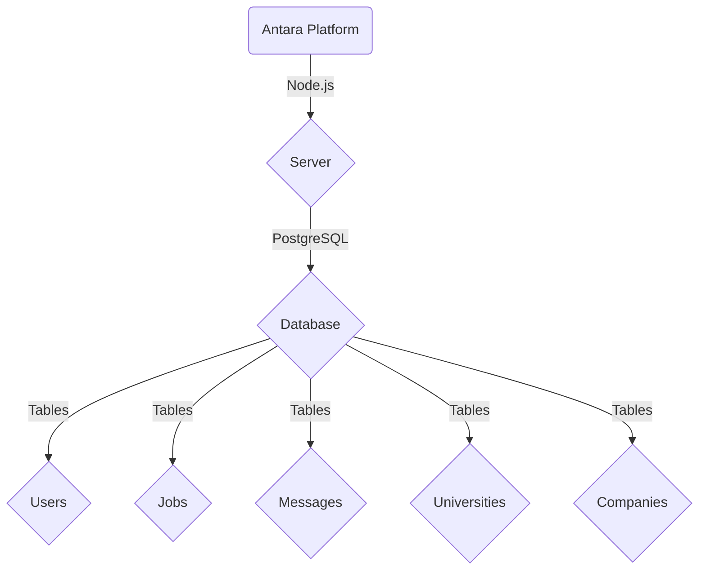

## <u>Table of Contents for a SRS Document</u>
1. Introduction
- 1.1 Purpose
- 1.2 Document Conventions
- 1.3 Intended Audience and Reading Suggestions
- 1.4 Project Scope
- 1.5 References
2. Overall Description
- 2.1 Product Perspective
- 2.2 Product Features
- 2.3 User Classes and Characteristics
- 2.4 Operating Environment
- 2.5 Design and Implementation Constraints
- 2.6 Assumptions and Dependencies
3. System Features
- 3.1 Functional Requirements
4. External Interface Requirements
- 4.1 User Interfaces
- 4.2 Hardware Interfaces
- 4.3 Software Interfaces
- 4.4 Communications Interfaces
5. Nonfunctional Requirements
- 5.1 Performance Requirements
- 5.2 Safety Requirements
- 5.3 Security Requirements
- 5.4 Software Quality Attributes
6. Architecture
- 6.1 System Overview
- 6.2 Frontend Architecture
- 6.3 Backend Architecture
- 6.4 Database Schema
- 6.5 Integration and APIs
- 6.6 Security Framework

# <u>Introduction</u>

###  <u>1.1 Purpose</u>

The purpose of this document is to outline the requirements and specifications for the development of the web platform named Antara. Antara aims to create a comprehensive ecosystem for students, universities, and companies, facilitating seamless interaction and engagement for hiring and working opportunities. This SRS document serves as a guide for developers, stakeholders, and project managers involved in the design, development, and implementation of Antara. It defines the functional and non-functional requirements, external interfaces, user classes, constraints, assumptions, and dependencies essential for the successful creation and deployment of the platform.

###  <u>1.2 Document Conventions</u>

The conventions followed throughout this document are as follows:

- **Section Headers**: Each section is marked with a hierarchical structure denoted by numbers and sub-numbers.
- **Formatting Style**: Markdown syntax is used for ease of readability and organization.
- **Naming Conventions**: Terms and entities are named in a consistent manner for clarity and understanding across the document.
- **References**: Any external sources or materials referenced are cited using standard citation styles.
- **Acronyms and Abbreviations**: Acronyms and abbreviations used within the document are defined upon first mention or in a glossary section for clarity.
- **Version Control**: Any updates or revisions to the document are noted with version numbers and dates to maintain a clear history of changes.

These conventions are employed to enhance comprehensibility, consistency, and accessibility for all stakeholders involved in the Antara project.

###  <u>1.3 Intended Audience and Reading Suggestions</u>

#### Intended Audience:

1. **Development Team**: Software developers, architects, and engineers involved in the creation and implementation of the Antara platform.
2. **Project Managers**: Individuals responsible for overseeing the project's progress, resource allocation, and timeline adherence.
3. **Stakeholders**: Investors, sponsors, and individuals invested in the success and outcome of the Antara platform.
4. **Designers**: UI/UX designers engaged in creating the user interfaces and experience for Antara.
5. **Quality Assurance/Testers**: Professionals responsible for testing and quality assurance of the developed platform.
6. **Future Maintainers**: Individuals who will be responsible for maintaining and updating the platform post-release.

#### Reading Suggestions:

1. **Overview Reading**: Start with the 'Introduction' and 'Overall Description' sections to understand the purpose, scope, and context of the Antara platform.
2. **Functional Teams**: Development, design, and testing teams should focus on 'System Features' and 'External Interface Requirements' sections for detailed functional requirements and interfaces.
3. **Stakeholders and Managers**: Concentrate on 'Project Scope,' 'Assumptions and Dependencies,' and 'Nonfunctional Requirements' sections to grasp the limitations, assumptions, and quality attributes of the Antara platform.
4. **Technical Teams**: Pay attention to 'Design and Implementation Constraints,' 'Software Interfaces,' and 'Communications Interfaces' sections for technical specifications and limitations.

Tailor your reading based on your role and responsibility within the Antara project to gain a comprehensive understanding of the requirements and expectations outlined in this document.

###  <u>1.4 Project Scope</u>

The project scope for Antara encompasses the following key aspects:

1. **Platform Objectives**:
   - **Connecting Universities, Companies, and Students**: Antara aims to establish a digital platform that facilitates interactions between universities offering educational programs, companies offering employment opportunities, and students seeking internships, part-time jobs, or full-time employment.
   - **Job and Internship Listings**: Providing a space for companies to post job openings and internship opportunities tailored to students' skills, preferences, and educational backgrounds.
   - **Student Profile Management**: Allowing students to create and manage profiles showcasing their academic achievements, skills, experiences, and preferences.
   - **University Profiles**: Enabling universities to present their programs, faculty, and campus details to prospective students and collaborating companies.
   - **Application and Hiring Process**: Facilitating a streamlined application, evaluation, and hiring process between companies and students.

2. **Features and Functionalities**:
   - **User Authentication and Profiles**: Secure login for students, universities, and companies with personalized profile management capabilities.
   - **Job/Internship Search and Listings**: Advanced search functionalities to browse, filter, and apply for relevant opportunities.
   - **Messaging and Communication**: In-platform communication channels between students, universities, and companies for inquiries, interviews, and discussions.
   - **Application Tracking**: Dashboard for tracking applications, interview schedules, and status updates.
   - **Data Privacy and Security**: Implementation of robust security measures to protect user data and ensure privacy compliance.
   - **Analytics and Reporting**: Tools to generate reports and insights for universities and companies regarding student engagement and hiring trends.

3. **Out-of-Scope Items**:
   - **Educational Content Delivery**: Antara does not involve direct delivery of educational content or coursework.
   - **Financial Transactions**: The platform does not handle financial transactions between users.

The project scope serves as a guideline for the development team and stakeholders to align their efforts, expectations, and deliverables throughout the lifecycle of Antara's development.

### <u>1.5 References</u>

The development and creation of the Antara platform draw upon the following references:

 1. Smith, J., & Johnson, A. (Year). "Building Successful Online Platforms: Best Practices." Publisher Name.

 2. Software Engineering Institute. (Year). "Software Requirements Specification (SRS) Guidelines."

 3. IEEE Computer Society. (Year). "IEEE Recommended Practice for Software Requirements Specifications."

 4. Online Platform Development Consortium. (Year). "Case Studies in Web Platform Development."

 5. Antara Project Proposal. (Date). Internal Document.

# <u>2. Overall Description</u>
### <u>2.1 Product Perspective</u>
The Antara platform operates within a comprehensive ecosystem that involves interactions between universities, companies, and students. It serves as an intermediary connecting these entities, facilitating seamless communication, and providing a structured environment for hiring and collaboration.

#### Key Components:

1. **User Interfaces**:
   - *Student Interface*: Provides tools for profile creation, job/internship searching, application submission, and communication.
   - *University Interface*: Offers features for showcasing programs, faculty details, and managing collaborations with companies and students.
   - *Company Interface*: Enables job/internship postings, candidate evaluation, and interaction with universities and students.

2. **Database and Backend Infrastructure**:
   - Manages user data, job/internship listings, communication logs, and authentication mechanisms.
   - Supports functionalities like search algorithms, data retrieval, and user management.

3. **External Interfaces**:
   - *Hardware*: Accessible through standard web browsers on desktops, laptops, tablets, and smartphones.
   - *Software*: Integration with external services for security, communication, and data analytics.
   - *Communications*: Facilitates communication between users via messaging systems and notifications.

4. **Constraints and Dependencies**:
   - Relies on secure data storage and encryption protocols to ensure user privacy.
   - Requires reliable internet connectivity for seamless platform access and interaction.
   - Integrates with university and company databases for real-time information updates.

5. **Interactions**:
   - Universities interact with students for program promotion and engagement.
   - Companies engage with students for hiring purposes and potential collaborations.
   - Students explore opportunities, apply for jobs/internships, and communicate with universities and companies.

###  <u>2.2 Product Features </u>

The Antara platform incorporates a range of features tailored to meet the needs of universities, companies, and students. These features aim to facilitate seamless interactions, job/internship discovery, application processes, and effective communication. The key features include:

#### For Students:

1. **Profile Creation and Management**:
   - Ability to create detailed profiles showcasing academic achievements, skills, experiences, and career preferences.
   - Options to update and manage profiles for better visibility to universities and companies.

2. **Job/Internship Search and Filtering**:
   - Advanced search functionalities allowing filtering based on job type, location, industry, and skills.
   - Notifications for newly posted opportunities matching student profiles and preferences.

3. **Application Tracking and Management**:
   - Dashboard to track submitted applications, interview schedules, and status updates.
   - Reminders and notifications for upcoming interviews and application deadlines.

4. **Communication Tools**:
   - Messaging system for direct communication with universities and companies regarding applications and inquiries.
   - Notifications for updates on application statuses and responses from recruiters.

#### For Universities:

1. **Program and Campus Showcase**:
   - Platform space to showcase programs, faculty details, campus infrastructure, and collaborations.
   - Tools for managing and updating program information to attract potential students.

2. **Engagement with Students**:
   - Interface to interact with prospective students, answer inquiries, and engage in discussions.
   - Access to student profiles for better understanding and targeting of potential candidates.

#### For Companies:

1. **Job/Internship Postings**:
   - Capability to post job openings and internship opportunities tailored to specific skill sets and qualifications.
   - Tools for managing posted opportunities, reviewing applications, and shortlisting candidates.

2. **Candidate Evaluation and Communication**:
   - Ability to evaluate candidate profiles, schedule interviews, and communicate directly with applicants.
   - Notification system for application updates and interview scheduling.
  ```mermaid
sequenceDiagram
    participant Student as "Student"
    participant University as "University"
    participant Company as "Company"

    Student->>Student: Update Profile
    Student->>University: Apply for Programs
    Student->>Company: Apply for Jobs

    University->>University: Manage Applicants
    University->>Student: Accept Applicants

    Company->>Company: Review Applications
    Company->>Student: Offer Job Positions
```


### <u>2.3 User Classes and Characteristics</u>

#### User Classes:

1. **Students**:
   - **Characteristics**: Varied educational backgrounds, seeking internships, part-time jobs, or full-time employment. Profile creation, job searching, and application tracking are primary activities.
  
2. **Universities**:
   - **Characteristics**: Educational institutions offering diverse programs. Activities include showcasing programs, engaging with students, and managing collaborations with companies.

3. **Companies**:
   - **Characteristics**: Entities offering employment opportunities. Posting jobs/internships, candidate evaluation, and communication with students and universities are primary tasks.

#### User Class Characteristics:

1. **Students**:
   - *Profiles*: Create and manage profiles highlighting academic achievements, skills, and preferences.
   - *Search and Apply*: Explore job/internship listings, apply for positions, and track application statuses.
   - *Communication*: Engage with universities and companies for inquiries and interview scheduling.

2. **Universities**:
   - *Program Showcase*: Display programs, faculty details, campus information, and collaborations.
   - *Engagement*: Interact with prospective students, answer queries, and manage partnerships.
   - *Access to Student Data*: View student profiles for potential recruitment or program engagement.

3. **Companies**:
   - *Job/Internship Postings*: Create and manage job/internship listings tailored to specific requirements.
   - *Candidate Evaluation*: Review student profiles, shortlist candidates, and schedule interviews.
   - *Direct Communication*: Communicate with students for interview scheduling and application updates.

### <u>2.4 Operating Environment</u>

#### Hardware Requirements:

1. **Users' Devices**:
   - Compatible with standard web browsers (Chrome, Firefox, Safari, Edge).
   - Support for desktops, laptops, tablets, and smartphones.
   - Minimum recommended screen resolution for optimal display.

2. **Server Infrastructure**:
   - Robust servers capable of handling concurrent user interactions and data processing.
   - Adequate storage capacity for user profiles, job listings, and communication logs.
   - Reliable internet connectivity to ensure uninterrupted platform accessibility.

#### Software Requirements:

1. **Frontend**:
   - HTML5, CSS3, JavaScript for interactive and responsive user interfaces.
   - Frameworks like React, Angular, or Vue.js for frontend development.
   - Compatibility with various browsers and versions for consistent performance.

2. **Backend**:
   - Server-side languages such as Node.js, Python, or Java for backend logic implementation.
   - Database systems (e.g., MySQL, MongoDB) for efficient data storage and retrieval.
   - Security protocols and encryption mechanisms for data protection.

3. **Other Software**:
   - Messaging and notification services for real-time communication.
   - Analytics and reporting tools for generating insights and performance metrics.
   - Integration with third-party services for authentication and additional functionalities.

#### Operating System Compatibility:

1. **Client-Side**:
   - Compatibility with major operating systems: Windows, macOS, Linux, iOS, Android.
   - Ensuring responsive design and functionality across diverse operating systems.

2. **Server-Side**:
   - Deployment on server environments compatible with chosen server-side technologies.
   - Compatibility with different server operating systems (e.g., Linux distributions, Windows Server).

### <u>2.5 Design and Implementation Constraints</u>

#### Design Constraints:

1. **User Experience (UX) Guidelines**:
   - Adherence to UX best practices for intuitive navigation and user-friendly interfaces.
   - Consistent design elements and layout across all user classes for ease of use.

2. **Responsive Design**:
   - Ensuring responsiveness across devices with varying screen sizes and resolutions.
   - Optimizing user interfaces for seamless interaction on both desktop and mobile platforms.

3. **Accessibility Standards**:
   - Compliance with accessibility guidelines (e.g., WCAG) for inclusivity and usability by individuals with disabilities.
   - Implementation of features like alt text for images, keyboard navigation, and readable content.

#### Implementation Constraints:

1. **Technology Compatibility**:
   - Integration with diverse technologies may pose interoperability challenges.
   - Compatibility testing across browsers, devices, and operating systems for consistent functionality.

2. **Data Security and Privacy**:
   - Implementation of robust security measures to protect user data and ensure compliance with privacy regulations (e.g., GDPR, CCPA).
   - Encryption of sensitive information during storage and transmission.

3. **Scalability and Performance**:
   - Designing an architecture capable of scaling to accommodate growing user numbers and data volumes.
   - Performance optimization to ensure quick response times and minimal downtime during peak usage.

4. **Resource Constraints**:
   - Limitations in server resources, bandwidth, or processing capabilities may impact the platform's performance and scalability.
   - Optimal utilization of resources to maintain efficiency and reduce overhead costs.

### <u>2.6 Assumptions and Dependencies</u>

#### Assumptions:

1. **User Data Accuracy**:
   - **Assumption**: Users provide accurate and updated information in their profiles.
   - **Impact**: Inaccurate data might affect job matching accuracy and communication.

2. **Stable Internet Connectivity**:
   - **Assumption**: Users have stable internet connections for seamless platform access.
   - **Impact**: Unstable connections may lead to interrupted interactions and application submissions.

3. **Third-Party Services Reliability**:
   - **Assumption**: External services (e.g., authentication, messaging) operate reliably.
   - **Impact**: Downtime or issues with third-party services could affect platform functionalities.

#### Dependencies:

1. **External APIs and Services**:
   - **Dependency**: Integration with external services for authentication, messaging, and analytics.
   - **Impact**: Platform functionalities rely on the availability and proper functioning of these services.

2. **Data Security Protocols**:
   - **Dependency**: Adherence to security protocols and encryption standards.
   - **Impact**: Ensures the protection of user data and compliance with privacy regulations.

3. **Development Frameworks and Libraries**:
   - **Dependency**: Use of specific frameworks, libraries, or development tools.
   - **Impact**: Efficiency and functionality are dependent on the capabilities and updates of these technologies.

4. **Regulatory Compliance**:
   - **Dependency**: Compliance with regional data privacy laws (e.g., GDPR, CCPA).
   - **Impact**: Ensuring legal adherence in handling user data and privacy protection.

# <u>3. System Features</u>

### <u>3.1 Functional Requirements</u>

#### User Authentication and Profiles:

1. **User Registration/Login**:
   - Users (students, universities, companies) can register and log in securely.
   - Authentication methods (e.g., email verification, two-factor authentication) ensure secure access.

2. **Profile Creation and Management**:
   - Users can create, edit, and manage their profiles.
   - Fields include personal information, educational background, skills, work experience, and preferences.

#### Job/Internship Listings and Applications:

3. **Job/Internship Posting**:
   - Companies can post job openings and internship opportunities with detailed descriptions.
   - Fields include job title, description, requirements, and application deadlines.

4. **Job/Internship Search and Filtering**:
   - Students can search and filter job/internship listings based on criteria like industry, location, and job type.

5. **Application Submission and Tracking**:
   - Students can submit applications for jobs/internships through the platform.
   - Dashboard to track submitted applications, interview schedules, and status updates.

#### Communication and Interaction:

6. **Messaging and Notifications**:
   - In-platform messaging system allowing direct communication between users (students, universities, companies).
   - Notifications for application updates, interview invitations, and messages.

7. **Engagement Tools**:
   - Universities and companies can engage with students through discussions, Q&A sessions, or webinars.

#### Analytics and Reporting:

8. **Reporting Dashboard**:
   - Analytics tools for universities and companies to track engagement metrics and hiring trends.
   - Generate reports on user activities, application statistics, and platform usage.

#### Administrative Functionality:

9. **User Management**:
   - Administrative tools to manage user accounts, roles, and permissions.
   - Ability to deactivate or suspend accounts when necessary.

10. **Content Management**:
   - Universities can manage program details, faculty information, and campus updates.
   - Companies can update job listings, modify descriptions, and close application windows.

# <u>4. External Interface Requirements</u>

### <u>4.1 User Interfaces</u>

#### Student Interface:

1. **Homepage**:
   - Welcome screen displaying job/internship recommendations, featured programs, and recent activities.
   - Navigation menu for profile management, job search, application tracking, and messaging.

2. **Profile Management**:
   - Interface for creating/editing profiles, adding educational background, skills, work experience, and preferences.
   - Section for uploading resumes, portfolios, and other relevant documents.

3. **Job/Internship Search**:
   - Search bar with filters (industry, location, job type) to refine job/internship listings.
   - Display of search results with job descriptions, company details, and application options.

4. **Application Tracking**:
   - Dashboard showing submitted applications, application statuses, interview schedules, and updates.
   - Notifications for application status changes and interview invitations.

5. **Messaging System**:
   - Chat interface for communicating with universities and companies regarding applications and inquiries.
   - Notification alerts for new messages and updates.

#### University Interface:

1. **Dashboard**:
   - Overview of program engagement, student interactions, and collaboration activities.
   - Tools for managing program details, faculty information, and campus updates.

2. **Program Showcase**:
   - Section for presenting programs, faculty details, campus infrastructure, and collaborations.
   - Features for updating program information, highlighting achievements, and testimonials.

3. **Engagement Tools**:
   - Discussion boards, Q&A sections, or webinar interfaces for engaging with prospective students.
   - Notifications for student queries and participation in discussions.

#### Company Interface:

1. **Job/Internship Posting**:
   - Interface for creating and managing job/internship listings with detailed descriptions.
   - Section to specify job requirements, qualifications, and application deadlines.

2. **Candidate Evaluation**:
   - Tools for reviewing student profiles, shortlisting candidates, and scheduling interviews.
   - Notifications for new applications and interview scheduling options.

3. **Communication Center**:
   - Messaging system for direct communication with applicants, scheduling interviews, and sending updates.
   - Alerts for new messages and application status changes.

### <u>4.2 Hardware Interfaces</u>

The Antara platform primarily interacts with standard hardware devices commonly used by users accessing the web-based application. These interfaces include:

1. **Desktop Computers**:
   - Compatibility with desktop systems running Windows, macOS, or Linux operating systems.
   - Standard hardware components (CPU, RAM, storage) sufficient for running web browsers.

2. **Laptops**:
   - Support for laptops with varying screen sizes and hardware configurations.
   - Compatibility with different operating systems commonly used on laptops.

3. **Tablets**:
   - Interface designed to be responsive and accessible on tablet devices.
   - Optimization for touch-based interactions and varying screen orientations.

4. **Smartphones**:
   - Responsive design for seamless access and functionality on smartphones.
   - Consideration for smaller screens, touch interactions, and mobile browser compatibility.

### <u>4.3 Software Interfaces</u>

The Antara platform interacts with various software components and interfaces to facilitate its operations, functionalities, and external integrations. These include:

1. **Web Browsers**:
   - Compatibility with major web browsers such as Google Chrome, Mozilla Firefox, Apple Safari, and Microsoft Edge.
   - Optimization for browser-specific features and compatibility across different versions.

2. **Backend Server**:
   - Interaction with server-side frameworks and programming languages (e.g., Node.js, Python, Java) for processing user requests, managing data, and logic implementation.
   - Integration with database systems (e.g., MySQL, MongoDB) for data storage and retrieval.

3. **External APIs and Services**:
   - Integration with third-party services for functionalities like user authentication (e.g., OAuth), messaging (e.g., WebSocket, Firebase Cloud Messaging), and analytics (e.g., Google Analytics).

4. **Messaging and Communication Services**:
   - Utilization of messaging APIs for real-time communication between users (students, universities, companies) within the platform.
   - Integration with notification services for alerts on application updates, new messages, and interview schedules.

5. **Analytics and Reporting Tools**:
   - Integration with analytics platforms to gather insights, track user activities, and generate reports on platform usage, engagement metrics, and hiring trends.

6. **Security Software and Protocols**:
   - Implementation of encryption algorithms, SSL/TLS protocols, and security measures to protect user data and ensure compliance with privacy regulations.

7. **Development Tools and Frameworks**:
   - Utilization of frontend frameworks (e.g., React, Angular, Vue.js) for creating responsive and interactive user interfaces.
   - Usage of version control systems (e.g., Git) and development environments for collaboration and code management.

### <u>4.4 Communications Interfaces</u>

The Antara platform incorporates various communication interfaces to facilitate seamless interactions among users (students, universities, and companies) within the platform:

1. **In-Platform Messaging**:
   - **User-to-User Messaging**: Enables direct communication between users (e.g., students, universities, companies) for inquiries, discussions, and interview scheduling.
   - **Notification System**: Alerts users about new messages, application updates, interview invitations, and other important notifications within the platform.

2. **Email Integration**:
   - **Notification Emails**: Sends email notifications to users for account-related activities (e.g., account creation, password reset).
   - **Communication Links**: Includes links within emails for users to directly access relevant sections of the platform (e.g., application details, message threads).

3. **Real-time Chat Features**:
   - **Live Chat or Discussion Boards**: Provides a real-time communication channel for universities to engage with prospective students through Q&A sessions, discussions, or webinars.
   - **Job-related Chat**: Facilitates live chat options during job application processes or interview stages between companies and students.

4. **Integration with External Communication Services**:
   - **Integration with Messaging APIs**: Enables integration with external messaging services for enhanced communication features (e.g., SMS notifications, push notifications).
   - **Social Media Sharing and Engagement**: Allows users to share job/internship postings or platform-related activities on social media platforms for wider reach and engagement.

5. **Interview Scheduling and Communication**:
   - **Scheduling Tools**: Provides interfaces for arranging interview schedules between companies and students within the platform.
   - **Reminder Notifications**: Sends automated reminders for upcoming interviews to both parties involved.

6. **User Engagement Analytics**:
   - **Communication Metrics**: Tracks user engagement metrics within communication interfaces (e.g., message response times, engagement rates) for analytics and platform optimization.

# <u>5. Nonfunctional Requirements</u>

### <u>5.1 Performance Requirements</u>

The performance requirements for the Antara platform encompass various aspects to ensure a responsive, reliable, and efficient user experience. These include:

1. **Response Time**:
   - **Requirement**: Achieve an average response time of no more than 2 seconds for page loads and interactions across different functionalities.
   - **Objective**: Ensure swift navigation and interaction within the platform to enhance user satisfaction.

2. **Scalability**:
   - **Requirement**: Support concurrent user interactions and data processing without significant performance degradation.
   - **Objective**: Ability to handle increased user traffic during peak periods without compromising system responsiveness.

3. **Uptime and Availability**:
   - **Requirement**: Maintain a minimum uptime of 99.9% excluding scheduled maintenance.
   - **Objective**: Ensure the platform is accessible to users consistently, minimizing downtime for optimal user engagement.

4. **Database Performance**:
   - **Requirement**: Database queries should execute within milliseconds for swift data retrieval and updates.
   - **Objective**: Optimize database performance to support quick access to user profiles, job listings, and application data.

5. **File Upload and Download Speed**:
   - **Requirement**: Ensure a file upload/download speed of at least 1 MB/s for attachments and documents within the platform.
   - **Objective**: Facilitate quick and efficient file handling, especially for resumes, portfolios, and job-related documents.

6. **Security and Performance Trade-offs**:
   - **Requirement**: Implement security measures without compromising system performance.
   - **Objective**: Balance stringent security protocols with system efficiency to maintain data integrity and user privacy.

7. **Load Testing Benchmarks**:
   - **Requirement**: Conduct regular load testing to ensure the platform's ability to handle peak loads.
   - **Objective**: Identify performance bottlenecks and optimize system resources to meet or exceed performance benchmarks.

8. **User Interaction Metrics**:
   - **Requirement**: Track and maintain user interaction metrics like click-through rates, application submission rates, and engagement times within acceptable thresholds.
   - **Objective**: Analyze user behavior to refine platform features and optimize performance based on user preferences and activities.

### <u>5.2 Safety Requirements</u>

The safety requirements for the Antara platform prioritize the security and privacy of user data, compliance with regulations, and measures to mitigate potential risks. These safety requirements include:

1. **Data Encryption**:
   - **Requirement**: Employ strong encryption mechanisms (e.g., SSL/TLS) for data transmission and storage, ensuring end-to-end encryption.
   - **Objective**: Protect sensitive user information such as personal details, resumes, and communication logs from unauthorized access or breaches.

2. **Access Control and Authentication**:
   - **Requirement**: Implement secure authentication methods (e.g., multi-factor authentication, CAPTCHA) to verify user identities during login and access.
   - **Objective**: Prevent unauthorized access to user accounts and sensitive platform features, ensuring user privacy.

3. **User Data Protection**:
   - **Requirement**: Adhere to data privacy regulations (e.g., GDPR, CCPA) concerning the collection, storage, and usage of user data.
   - **Objective**: Safeguard user data from misuse, unauthorized sharing, or exploitation, ensuring compliance with legal requirements.

4. **Regular Security Audits**:
   - **Requirement**: Conduct periodic security audits and vulnerability assessments to identify and address potential security loopholes.
   - **Objective**: Proactively detect and remediate security vulnerabilities to prevent data breaches or unauthorized access.

5. **Data Backup and Recovery**:
   - **Requirement**: Establish routine data backup procedures and recovery mechanisms to safeguard against data loss or system failures.
   - **Objective**: Ensure the availability and integrity of data even in the event of system failures or unforeseen incidents.

6. **Incident Response Plan**:
   - **Requirement**: Develop an incident response plan outlining procedures for handling security breaches, data leaks, or system compromises.
   - **Objective**: Enable swift and effective responses to security incidents to minimize their impact and restore system integrity.

7. **Training and Awareness**:
   - **Requirement**: Provide security awareness training for platform users and administrators regarding best practices for data protection and safe usage.
   - **Objective**: Empower users to recognize potential security threats and adopt safe behaviors within the platform.

8. **Regulatory Compliance**:
   - **Requirement**: Ensure ongoing compliance with relevant data protection and privacy laws based on the platform's operational jurisdiction.
   - **Objective**: Avoid legal implications and penalties by adhering to regulatory frameworks concerning user data and privacy.

### <u>5.3 Security Requirements</u>

The Antara platform is designed with robust security measures to safeguard user data, prevent unauthorized access, and ensure a secure environment for all interactions. The security requirements include:

1. **User Authentication**:
   - **Requirement**: Implement strong authentication methods such as password hashing, multi-factor authentication (MFA), or biometric authentication for user logins.
   - **Objective**: Ensure only authorized users can access their accounts, preventing unauthorized access.

2. **Access Control**:
   - **Requirement**: Enforce role-based access control (RBAC) mechanisms to limit user access to specific functionalities based on their roles (e.g., student, university, company).
   - **Objective**: Restrict unauthorized users from accessing sensitive data or administrative features.

3. **Data Encryption**:
   - **Requirement**: Apply encryption protocols (e.g., SSL/TLS) for data transmission and storage to protect sensitive information (e.g., user credentials, communication logs).
   - **Objective**: Safeguard data integrity and confidentiality, preventing interception or tampering during transmission or storage.

4. **Secure APIs and Interfaces**:
   - **Requirement**: Implement secure coding practices and validate input/output data in APIs to prevent injection attacks (e.g., SQL injection, XSS).
   - **Objective**: Mitigate risks of malicious attacks targeting the platform through exposed APIs or vulnerable interfaces.

5. **Regular Security Updates and Patch Management**:
   - **Requirement**: Perform timely updates and patch management for all software components, including frameworks, libraries, and server systems.
   - **Objective**: Address known vulnerabilities and security weaknesses to maintain system integrity and resilience against potential threats.

6. **Logging and Monitoring**:
   - **Requirement**: Establish comprehensive logging mechanisms to track user activities, system events, and security-related incidents.
   - **Objective**: Enable real-time monitoring and auditing to detect and respond to security breaches or unusual activities promptly.

7. **Secure Session Management**:
   - **Requirement**: Implement secure session handling mechanisms, including session timeouts and token-based authentication, to prevent session hijacking or fixation.
   - **Objective**: Ensure user sessions remain secure and unauthorized access to active sessions is mitigated.

8. **Firewalls and Intrusion Detection/Prevention Systems (IDS/IPS)**:
   - **Requirement**: Deploy firewalls and intrusion detection/prevention systems to monitor and block suspicious network traffic or activities.
   - **Objective**: Detect and mitigate potential attacks, unauthorized access attempts, or anomalous behavior within the platform.

9. **Backup and Disaster Recovery**:
   - **Requirement**: Implement regular backups and disaster recovery procedures to ensure data availability and system resilience in case of incidents.
   - **Objective**: Enable quick recovery and minimize data loss in the event of system failures, breaches, or disasters.

### <u>5.4 Software Quality Attributes</u>

The Antara platform is developed with a focus on various quality attributes to ensure a high standard of performance, reliability, usability, and maintainability. These software quality attributes include:

1. **Reliability**:
   - **Requirement**: Achieve a high level of reliability to minimize system failures or unexpected downtime.
   - **Objective**: Ensure consistent and dependable platform availability for users.

2. **Performance**:
   - **Requirement**: Optimize performance to deliver quick response times and efficient data processing.
   - **Objective**: Provide a responsive and seamless user experience during interactions within the platform.

3. **Usability**:
   - **Requirement**: Design intuitive user interfaces and navigation to enhance user-friendliness.
   - **Objective**: Ensure ease of use and accessibility across different user classes for a positive user experience.

4. **Scalability**:
   - **Requirement**: Design the platform to handle increased user loads without sacrificing performance.
   - **Objective**: Enable the platform to scale up or down efficiently based on user demand.

5. **Maintainability**:
   - **Requirement**: Implement clean and modular code, adhering to best coding practices and documentation standards.
   - **Objective**: Facilitate easy maintenance, updates, and modifications for future enhancements or bug fixes.

6. **Security**:
   - **Requirement**: Implement robust security measures to protect user data, prevent breaches, and ensure compliance with privacy regulations.
   - **Objective**: Establish a secure environment, minimizing vulnerabilities and potential risks.

7. **Compatibility**:
   - **Requirement**: Ensure compatibility with various devices, browsers, and operating systems commonly used by users.
   - **Objective**: Provide consistent functionality and display across different platforms and configurations.

8. **Testability**:
   - **Requirement**: Develop comprehensive test suites for functionalities and modules to ensure thorough testing coverage.
   - **Objective**: Facilitate effective testing processes to identify and rectify potential issues or bugs.

9. **Accessibility**:
   - **Requirement**: Comply with accessibility standards (e.g., WCAG) to ensure inclusivity for users with disabilities.
   - **Objective**: Make the platform accessible to a wide range of users, regardless of their abilities.

10. **Documentation**:
    - **Requirement**: Maintain detailed documentation for developers, users, and administrators, outlining platform functionalities and procedures.
    - **Objective**: Enable easy understanding, usage, and troubleshooting of the platform.

# <u>6. Architecture</u>

### <u>6.1 System Overview</u>

The Antara platform is designed as an interactive web-based system that facilitates connections between students, universities, and companies. It serves as a collaborative space where students can explore job opportunities, universities can showcase their programs, and companies can post job listings. The system operates on a client-server architecture, enabling seamless interactions through a user-friendly interface.

#### Key Components:

1. **Frontend Interface**:
   - Provides an intuitive user interface accessible via web browsers.
   - Facilitates user interactions, job searches, profile management, and messaging functionalities.

2. **Backend Server**:
   - Manages user requests, data processing, and business logic.
   - Responsible for user authentication, data retrieval, and storage operations.

3. **Database Infrastructure**:
   - Stores user profiles, job listings, messages, and other platform-related data.
   - Utilizes PostgreSQL as the primary database system for data storage and retrieval.

4. **Integration and APIs**:
   - Integrates with third-party services for authentication, messaging, and analytics.
   - Provides APIs for communication between the frontend, backend, and external services.

5. **Security Framework**:
   - Implements robust security measures to protect user data and ensure compliance with privacy regulations.
   - Incorporates encryption, access control, and regular security audits to maintain system integrity.

### <u>6.2 Frontend Architecture</u>

The frontend architecture of the Antara platform is structured to deliver an intuitive and responsive user interface, ensuring seamless interactions for students, universities, and companies. It comprises various components and technologies working together to present a user-friendly experience.

#### Components:

1. **UI Frameworks**:
   - Utilizes modern UI frameworks like React.js, Vue.js, or Angular for building dynamic and responsive user interfaces.
   - Implements reusable components to ensure consistency and ease of maintenance.

2. **Client-Side Rendering**:
   - Emphasizes client-side rendering to enable faster initial page loads and smoother user interactions.
   - Optimizes performance by efficiently handling frontend logic and reducing server load.

3. **Responsive Design**:
   - Adopts responsive design principles to ensure compatibility across devices (desktops, laptops, tablets, smartphones).
   - Utilizes CSS frameworks (such as Bootstrap or Tailwind CSS) for consistent and adaptable layouts.

4. **State Management**:
   - Implements state management libraries (e.g., Redux, Vuex) to manage and maintain application state across components.
   - Facilitates efficient data flow and synchronization within the application.

5. **API Integration**:
   - Communicates with the backend server through RESTful or GraphQL APIs to fetch and send data.
   - Handles asynchronous requests for user authentication, job listings, profile data, and messaging.

6. **User Experience (UX)**:
   - Prioritizes UX design principles to ensure an intuitive and user-friendly interface.
   - Implements smooth navigation, clear information architecture, and intuitive workflows.

7. **Testing and Debugging**:
   - Utilizes testing frameworks (e.g., Jest, React Testing Library) for unit tests, integration tests, and end-to-end testing to ensure robustness and reliability.
### <u>6.3 Backend Architecture</u>

The backend architecture of the Antara platform serves as the foundation for handling user requests, managing data, and implementing business logic. It comprises various components and technologies working together to ensure the platform's functionality and reliability.

#### Components:

1. **Server-Side Framework**:
   - Utilizes Node.js, Python (Django/Flask), Java (Spring Boot), or other frameworks to handle server-side operations.
   - Executes backend logic, handles HTTP requests, and manages routing.

2. **Application Logic**:
   - Implements business logic for user authentication, job postings, profile management, and messaging functionalities.
   - Validates and processes incoming requests from the frontend to interact with the database.

3. **API Endpoints**:
   - Defines RESTful or GraphQL APIs to facilitate communication between the frontend and backend.
   - Handles CRUD (Create, Read, Update, Delete) operations for users, job listings, messaging, and other entities.

4. **Authentication and Authorization**:
   - Implements secure authentication mechanisms (e.g., JWT, OAuth) for user login and access control.
   - Authorizes user access based on roles and permissions within the platform.

5. **Database Management**:
   - Utilizes PostgreSQL as the primary database system for data storage, retrieval, and management.
   - Defines database schemas, tables, and relationships to store user profiles, job listings, messages, etc.

6. **Middleware and Services**:
   - Incorporates middleware components for request processing, logging, error handling, and data validation.
   - Integrates with external services for functionalities like email notifications, analytics, and messaging.

7. **Security Measures**:
   - Implements encryption protocols, input validation, and parameterized queries to prevent security vulnerabilities (e.g., SQL injection, XSS attacks).
   - Conducts regular security audits and follows best practices to ensure data integrity and protection.

8. **Scalability and Performance Optimization**:
   - Designs scalable architectures to handle increased user loads without compromising performance.
   - Optimizes database queries, indexes, and caching strategies for efficient data retrieval and system responsiveness.


### <u>6.4 Database Schema</u>

The database schema for the Antara platform encompasses the structured organization of tables and relationships to efficiently store and manage data related to users, job postings, messaging, and other crucial entities within the system. Here's an outline of the database schema:

#### User-related Tables:

1. **Users Table**:
   - Fields: `user_id`, `username`, `email`, `password`, `role`, `created_at`, `updated_at`, etc.
   - Stores user authentication details, roles, and timestamps.

2. **Student Profile Table**:
   - Fields: `student_id`, `user_id` (Foreign Key), `name`, `education`, `skills`, `experience`, `preferences`, etc.
   - Contains details specific to student profiles like educational background, skills, and work experience.

3. **University Profile Table**:
   - Fields: `university_id`, `user_id` (Foreign Key), `name`, `location`, `programs`, `faculties`, `campus_details`, etc.
   - Stores information related to universities including program details, faculties, and campus information.

4. **Company Profile Table**:
   - Fields: `company_id`, `user_id` (Foreign Key), `name`, `industry`, `location`, `description`, `job_listings`, etc.
   - Contains details about companies such as industry, location, and job listings posted.

#### Job-related Tables:

5. **Job Listings Table**:
   - Fields: `job_id`, `company_id` (Foreign Key), `title`, `description`, `requirements`, `location`, `posted_date`, `deadline`, etc.
   - Stores details of job listings posted by companies.

#### Messaging Tables:

6. **Messages Table**:
   - Fields: `message_id`, `sender_id` (Foreign Key), `receiver_id` (Foreign Key), `content`, `timestamp`, etc.
   - Manages communication between users including students, universities, and companies.

### <u>6.5 Integration and APIs</u>

The Antara platform integrates various APIs and external services to enhance its functionalities, facilitate communication, and ensure seamless operations across different modules. These integrations enable interactions between the platform and external systems, providing extended features and services to users.

#### Integration Components:

1. **Third-Party Authentication APIs**:
   - Integrates with OAuth, Google Sign-In, or other authentication services for user login and account verification.

2. **Messaging Services APIs**:
   - Incorporates messaging APIs (e.g., WebSocket, Firebase Cloud Messaging) for real-time communication between users within the platform.

3. **External Communication APIs**:
   - Utilizes SMTP or other email APIs for sending notifications, account verifications, and updates to users via email.

4. **Analytics and Reporting APIs**:
   - Integrates with analytics platforms (e.g., Google Analytics) to gather insights, track user activities, and generate reports on platform usage and trends.

5. **Job Aggregator APIs**:
   - Connects with external job aggregator APIs (e.g., Indeed, Glassdoor) to supplement job listings available on the platform.

6. **Payment Gateways (if applicable)**:
   - Integrates payment gateways (e.g., PayPal, Stripe) for handling transactions related to premium services or job postings.

7. **Cloud Storage APIs**:
   - Utilizes cloud storage APIs (e.g., Amazon S3, Google Cloud Storage) for storing and managing user-generated content like resumes, portfolios, or multimedia files.

#### Custom APIs:

1. **RESTful or GraphQL APIs**:
   - Defines custom APIs within the platform to facilitate communication between the frontend and backend components.
   - Enables functionalities such as user profile management, job search, application submission, and messaging.

2. **API Documentation**:
   - Provides comprehensive documentation for developers to understand and utilize the platform's APIs efficiently.

### <u>6.6 Security Framework</u>

The security framework implemented within the Antara platform encompasses a multi-layered approach to safeguard user data, prevent unauthorized access, and ensure compliance with privacy regulations. It comprises various security measures and protocols aimed at maintaining a secure environment for users and their interactions.

#### Key Components:

1. **Encryption Protocols**:
   - Utilizes SSL/TLS encryption for secure data transmission between the frontend and backend components, ensuring data confidentiality.

2. **Authentication Mechanisms**:
   - Implements robust authentication methods like JWT (JSON Web Tokens) or OAuth for user login, session management, and access control.

3. **Access Control**:
   - Enforces role-based access control (RBAC) to manage user permissions and restrict unauthorized access to sensitive data or features.

4. **Data Validation and Sanitization**:
   - Implements strict input validation and sanitization techniques to prevent common vulnerabilities like SQL injection or XSS attacks.

5. **Security Audits and Testing**:
   - Conducts regular security audits and vulnerability assessments to identify and rectify potential security loopholes or weaknesses.

6. **Privacy Compliance**:
   - Ensures compliance with data protection regulations (e.g., GDPR, CCPA) concerning the collection, storage, and handling of user data.

7. **Secure Coding Practices**:
   - Adheres to secure coding standards and practices to mitigate security risks during software development, reducing vulnerabilities.

8. **Monitoring and Logging**:
   - Implements real-time monitoring and logging mechanisms to track system activities, detect anomalies, and respond to security incidents promptly.

9. **Regular Updates and Patch Management**:
   - Performs timely updates and patch management for software components, frameworks, and libraries to address known security vulnerabilities.

10. **Incident Response Plan**:
    - Develops and maintains an incident response plan outlining procedures for handling security breaches, data leaks, or unauthorized access.

11. **User Education and Awareness**:
    - Conducts security awareness programs and provides guidelines to users to recognize potential security threats and adopt safe practices.


